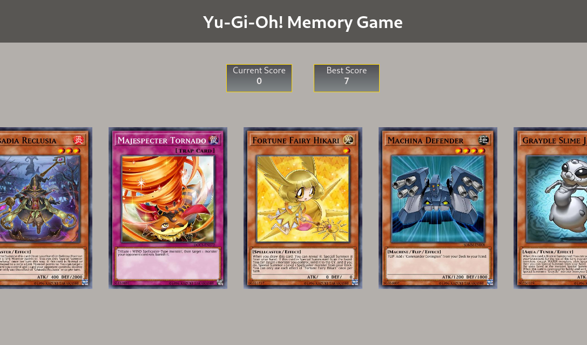

# [TheOdinProject](https://www.theodinproject.com/)

## Project: Memory Game



A basic Yu-Gi-Oh card memory game built with typescript and React.

API fetched from [YGOPRODECK](https://ygoprodeck.com/)

## Features

- React hooks
- Scoring system
- Difficulty scaling

## Installation

Clone the repository:

```bash
git clone https://github.com/Alberinea/memory-game.git
```

Open the project folder:

```bash
cd memory-game
```

Install all dependencies:

```bash
npm i
```

Run the app in development mode:

```bash
npm start
```

It should automatically open the App in your browser.

If that is not the case, open [port3000](http://localhost:3000/).

[Live Demo](https://alberinea.github.io/memory-game/)
